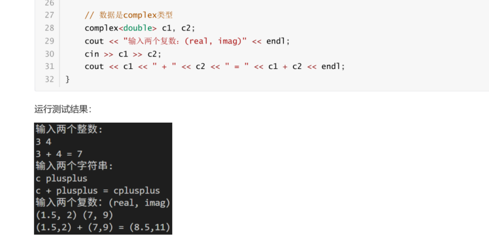

# 42L是long long
```c++
cout<<42L<<endl;
#L代表long long
```

# std::round
`四舍五入`函数
```c++
std::round(3*4.66);
#四舍五入
```

# complex
表示`虚数`

```c++
complex<double> z(2.0,3.0);
#虚数2 + 3i
```

# 类

&emsp;&emsp;`int sum() const;`这个`const`可有可无，<font color = 'red',size = ,face = >有了表示不能更改参数</font>

```c++
class X {
public:
// 成员函数
    X(); #默认构造
    X(int a_, int b_, int c_);#普通构造
    X(const X &t);#复制构造
//   X(const &&t); 
    #移动构造
    # x2(move(x1)); #移动构造

    ~X();#析构函数

    void set(int a_, int b_, int c_);
    int sum() const;
    int product() const;
private:
// 成员数据
    int a, b, c;
};
```

# 函数构造的引用
```c++
class X;
fun(X);
会先复制构造

fun(&X);
不会调用构造函数

```