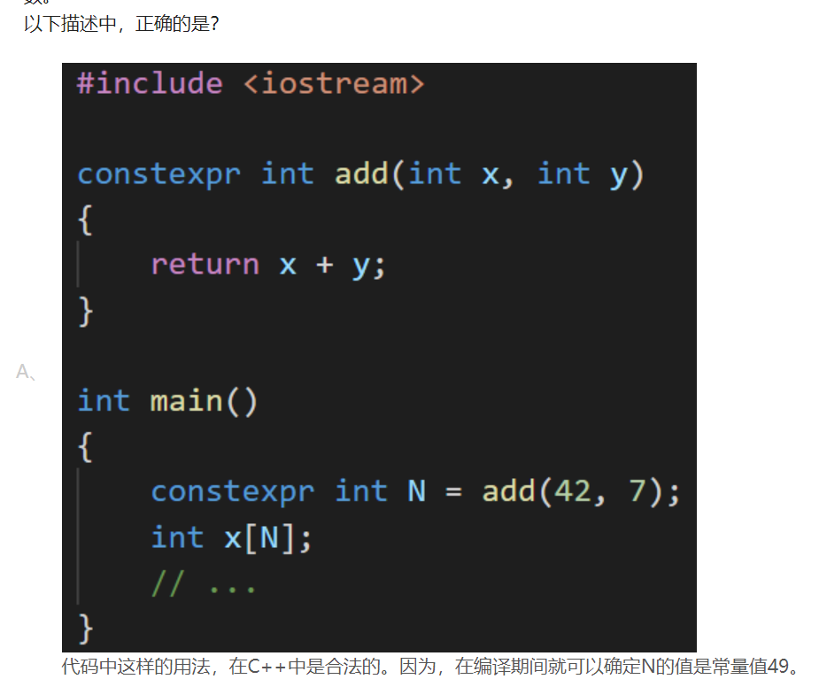
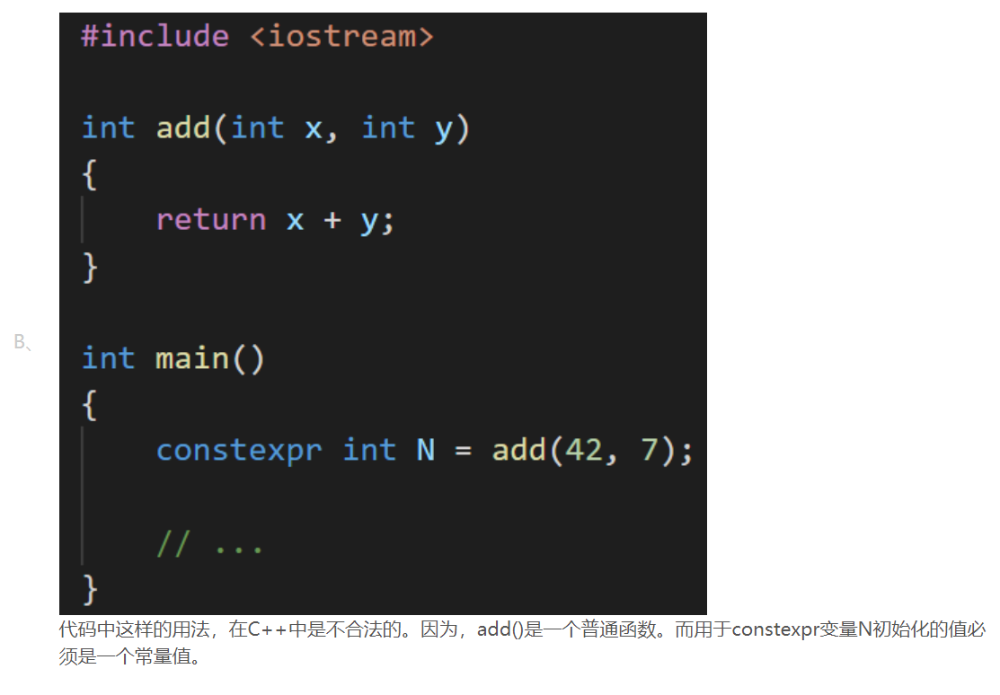
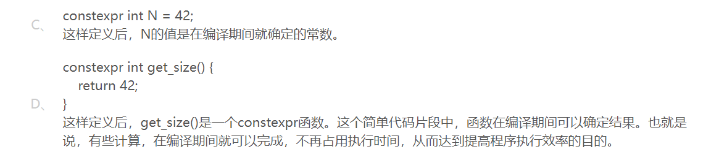
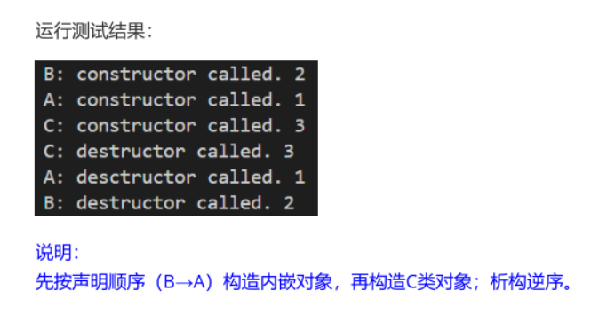
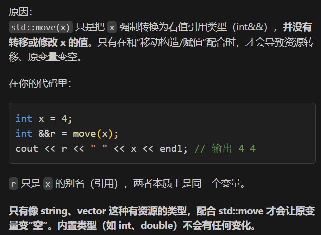

# 预编译
```c++
#define ld long double

typedef long double ld

using ld = long double;
```

# decltype 用法

`decltype` 用于根据表达式自动推断类型。
`auto`也是自动类型推导

### 示例

```cpp
int a = 10;
decltype(a) b = 20; // b 的类型和 a 一样，都是 int

double x = 3.14;
decltype(x + a) y; // y 的类型是 double

// 用于函数返回值类型推断
template<typename T, typename U>
auto add(T t, U u) -> decltype(t + u) {
    return t + u;
}
```

# 不同const常量
```c++
#define a 1
const int b = 1; 
constexpr int c = 1; #编译期常量，速度更快
#错误写法
int n;
cin>>n;
constexpr int c = n;
#constexpr是编译期常量，不能在运行期赋值
```

## constexpr




# 赋值
```c++
int xq = 1;
int aq(4.5); #可以运行，但是会缺失精度
int s1{4.5} #编译速度快，但不可运行，要求必须满足类型
```
# 多种类型转换
```c++
static_cast<int>(5.2);

```
# 引用变量
多个引用变量可以绑定到同一个变量
`引用`必须初始化
```c++
int x = 42;
int &rx = x;
int &rx2 = x;

#错误写法
int &r = 42
#正确写法
const int &r = 42;
int&& r = 42;
```

# for循环
```c++
vector<string> v1{"hi","add","xyz"};

for(auto i : v1)
#创建副本

for(const auto &i : v1)
#引用类型，不加const可以更改值
#更有效率
```

# 控制输出

```c++
#include <iomanip>

cout<<setw(4)<<x<<endl;
#设置输出宽度
cout<<setfill('#")<<set(4)<<x<<endl;
设置输出宽度，不足的用‘#’填充
```

# 内联函数

`简单的`、`频繁调用`的函数
如果有`循环`和`switch`语句，则编译器`不同意`设置为内联函数，因为不够简单

# 带有默认值的函数

默认值要在函数`后面`，`靠右放置`

如果有`函数声明`，在函数声明中给`默认值`，定义中不要重复给。也可反过来，但`不推荐`。

* 一定`不可以同时标明默认参数`

# 模板函数
不管是函数还是声明，都要重复定义
```c++
template<typename T>
void func(T x)
{
    ....;
}

template<typename T>
void func(T x)
{
    ....;
}
```

# 类
构造函数可以重载，析构函数不可重载

类函数的实现在`类定义内部`，则是`内联函数`，否则不是

`public`:公有
`private`:私有
`protected`:

再不定义构造函数的时候，编译器自动生成默认构造函数，如果定义了构造函数，则不自动生成

下面的构造函数可以运行，因为构造的只有默认参数
```c++
X(int x = 4):m{x} {}


X x;
```

```c++
class X {
public:
// 成员函数
    X(); #默认构造
    X(int a_, int b_, int c_);#普通构造
    X(const X &t);#复制构造
    X(X &&t); #移动构造#// x2(move(x1)); #移动构造

    ~X();#析构函数

    void set(int a_, int b_, int c_);
    int sum() const;
    int product() const;
private:
// 成员数据
    int a, b, c;
};

X::X(int a_, int b_, int c_):a{a_},b{b_},c{c_}
{
    cout<<"1\n";        
};

X::X()
{
    cout<<"hrere\n";
};

X::X(const X &t):a{t.a},b{t.b},c{t.c}
{
    cout<<"copy\n";
}

X::~X()
{
    cout<<"destroy\n";
}
```

## 临时对象
可以不定义类直接使用
```c++
X().show();
X(42).show();
```

## 初始化内嵌对象
```c++

C(int x,int y,int z):obj_A{x},obj_B{y},mc{z} {}

private:
    B obj_B;
    A obj_A;
    int mc;
```
* 最后调用顺序是：B->A->C
* 按照类定义里声明的顺序构造


# 右值引用
`std::move()`强制转换成右值

`右值`不可寻址
`左值`可以寻址

```c++
int x  =42;
int y  =x;

int &r1 = x; #左值
int &&r2 = 42;#右值引用
int &&r3 = func();#右值引用
int &&r4 = std::move(x);
```


