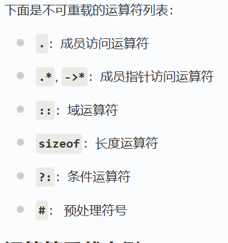

# 预编译
```c++
#define ld long double

typedef long double ld

using ld = long double;
```

# decltype 用法

`decltype` 用于根据表达式自动推断类型。
`auto`也是自动类型推导

### 示例

```cpp
int a = 10;
decltype(a) b = 20; // b 的类型和 a 一样，都是 int

double x = 3.14;
decltype(x + a) y; // y 的类型是 double

// 用于函数返回值类型推断
template<typename T, typename U>
auto add(T t, U u) -> decltype(t + u) {
    return t + u;
}
```

# 不同const常量
```c++
#define a 1
const int b = 1; 
constexpr int c = 1; #编译期常量，速度更快
#错误写法
int n;
cin>>n;
constexpr int c = n;
#constexpr是编译期常量，不能在运行期赋值
```

# const 成员函数
不能调用非const函数

const也能作为成员函数的重载函数区分（const类优先匹配const函数）

## constexpr


# 赋值
```c++
int xq = 1;
int aq(4.5); #可以运行，但是会缺失精度
int s1{4.5} #编译速度快，但不可运行，要求必须满足类型
```
# 多种类型转换
```c++
static_cast<int>(5.2);

```
# 引用变量
多个引用变量可以绑定到同一个变量
`引用`必须初始化
引用绑定之后不可换绑
```c++
int x = 42;
int &rx = x;
int &rx2 = x;

#错误写法
int &r = 42
#正确写法
const int &r = 42;
int&& r = 42;
```

# for循环
```c++
vector<string> v1{"hi","add","xyz"};

for(auto i : v1)
#创建副本

for(const auto &i : v1)
#引用类型，不加const可以更改值
#更有效率
```

# 控制输出

```c++
#include <iomanip>

cout<<setw(4)<<x<<endl;
#设置输出宽度
cout<<setfill('#")<<set(4)<<x<<endl;
设置输出宽度，不足的用‘#’填充
```

# 内联函数

`简单的`、`频繁调用`的函数
如果有`循环`和`switch`语句，则编译器`不同意`设置为内联函数，因为不够简单

# 带有默认值的函数

默认值要在函数`后面`，`靠右放置`

如果有`函数声明`，在函数声明中给`默认值`，定义中不要重复给。也可反过来，但`不推荐`。

* 一定`不可以同时标明默认参数`

# 模板函数
不管是函数还是声明，都要重复定义
```c++
template<typename T>
void func(T x)
{
    ....;
}

template<typename T>
void func(T x)
{
    ....;
}
```

# 类
构造函数可以重载，析构函数不可重载

类函数的实现在`类定义内部`，则是`内联函数`，否则不是

`public`:公有
`private`:私有
`protected`:

再不定义构造函数的时候，编译器自动生成默认构造函数，如果定义了构造函数，则不自动生成

下面的构造函数可以运行，因为构造的只有默认参数
```c++
X(int x = 4):m{x} {}


X x;
```

```c++
class X {
public:
// 成员函数
    X(); #默认构造
    X(int a_, int b_, int c_);#普通构造
    X(const X &t);#复制构造
    X(X &&t); #移动构造#// x2(move(x1)); #移动构造

    ~X();#析构函数

    void set(int a_, int b_, int c_);
    int sum() const;
    int product() const;
private:
// 成员数据
    int a, b, c;
};

X::X(int a_, int b_, int c_):a{a_},b{b_},c{c_}
{
    cout<<"1\n";        
};

X::X()
{
    cout<<"hrere\n";
};

X::X(const X &t):a{t.a},b{t.b},c{t.c}
{
    cout<<"copy\n";
}

X::~X()
{
    cout<<"destroy\n";
}
```

## 临时对象
可以不定义类直接使用
```c++
X().show();
X(42).show();
```

## 初始化内嵌对象
```c++

C(int x,int y,int z):obj_A{x},obj_B{y},mc{z} {}

private:
    B obj_B;
    A obj_A;
    int mc;
```
* 最后调用顺序是：B->A->C
* 按照类定义里声明的顺序构造


# 右值引用
`std::move()`强制转换成右值

`右值`不可寻址
`左值`可以寻址

```c++
int x  =42;
int y  =x;

int &r1 = x; #左值
int &&r2 = 42;#右值引用
int &&r3 = func();#右值引用
int &&r4 = std::move(x);
```


# 类中的const变量

只能通过`构造函数初始化列表`初始化

# 类中的static变量

在`类的外部`需要进行`定义`和`初始化`

```c++
#include <iostream>
using namespace std;
class MyClass {
public:
   static int staticVar; // 声明静态成员变量
};
// 定义并初始化静态成员变量
int MyClass::staticVar = 0;
int main() {
   MyClass obj1, obj2;
   // 通过类名访问静态变量
   MyClass::staticVar = 10;
   cout << "StaticVar (via class): " << MyClass::staticVar << endl;
   // 通过对象访问静态变量
   obj1.staticVar = 20;
   cout << "StaticVar (via object): " << obj2.staticVar << endl;
   return 0;
}
```
## 注意

* 静态成员变量的定义必须在类的外部进行，且只能初始化一次。

* 如果静态成员变量是 `const`，可以在`类内`直接`初始化`。

* 静态成员函数不能访问非静态成员，因为它们没有 this 指针。

```c++
#include <iostream>
using namespace std;
class MyClass {
public:
   static const int staticVar; 
};

const int MyClass::staticVar = 0;
int main() {
   
   return 0;
}
```

# 友元friend

类的友元函数是定义在类外部，但有权访问类的所有私有（private）成员和保护（protected）成员。尽管友元函数的原型有在类的定义中出现过，但是友元函数并不是成员函数。

友元可以是一个函数，该函数被称为友元函数；友元也可以是一个类，该类被称为友元类，在这种情况下，整个类及其所有成员都是友元。

基类的友元函数是派生类的友元函数，但是友元的友元不是友元，没有传递

# 深复制和浅复制

* 浅复制会导致复制版类中的指针也指向原类中指针的地址（指针复制地址），编译器默认的是浅复制
  

* 深复制完全开辟新的空间，需要自己实现（vector等自己已实现）

# 继承?
```c++
class Y:public std::vector<int>{
public:
    ///using std::vector<int>::vector;
    Y() = default;
    Y(int n) : vector<int>(n){}
    Y(std::initializer_list<int> ls) : vector<int>(ls){}

    void sort(bool flag = true)
    {
        if(flag)
            std::sort(this->begin(),this->end());
        else
            std::sort(this->begin(),this->end(),std::greater<int>());
    }
};
```
* 继承方式(public,private,protected)缺少时，默认`private`
* private 成员在类外部不能访问
* 其余成员，权限按小的（继承方式和基类的权限相比较）
## 注意点
* 构造函数/析构函数不能被继承
* 派生类须自定义构造函数/析构函数
* 若都采用编译器的默认构造函数，则可不写
* 基类的类型指针和引用可以指向派生类，但调用的是基类接口（如果在基类的接口加上virtual，则可调用相应的派生类接口）

```c++
#include <bits/stdc++.h>
using namespace std;

class A
{
    private:
        int a,b;
        void func(){cout<<"private function\n";}
    public:
        void func1(){cout<<"public function\n";}
};

class B : public A{
    public:
        void func1(){cout<<"B public function\n";}
};

int main()
{
    B b;
    //调用基类的func1,使用作用运算符
    b.A::func1();
    //调用自己的func1
    b.func1();
}
```

# 虚基类
在C++中，虚基类（Virtual Base Class）是用来解决特定的继承问题的一种机制。当多个派生类继承自同一个基类，并且又有一个类继承自这些派生类时，就会出现一个问题：最终的派生类将包含多个基类的副本。为了解决这个问题，C++引入了虚基类的概念，确保在继承层次中基类只有一个唯一的实例。

当声明一个类为虚基类时，使用关键字virtual。这告诉编译器在派生类中只保留一个基类的副本，即使有多个中间派生类从同一个基类继承。这样，当有多个路径可以到达同一个基类时，基类的构造函数只会被调用一次，避免了多重继承时的二义性问题。

* virtual public虚继承方式（class A : virtual public B{}）

```c++
class Base {
public:
   Base(int s) {
       a = s;
       cout << "base=" << a << endl;
   }
protected:
   int a;
};
class Base1 : virtual public Base {
public:
   Base1(int s, int h) : Base(s) {
       a += h;
       cout << "base1=" << a << endl;
   }
};
class Base2 : virtual public Base {
public:
   Base2(int s) : Base(s) {
       a += 20;
       cout << "base2=" << a << endl;
   }
};
class Derived : public Base1, public Base2 {
public:
   Derived(int s, int h, int d) : Base(s), Base1(s, h), Base2(s) {
       cout << "derived a =" << a + d << endl;
   }
};
int main() {
   Derived obj(5, 8, 9);
   return 0;
}
```

# 多态
## 绑定
* 动态绑定
* 静态绑定

# 运算符重载



