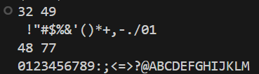
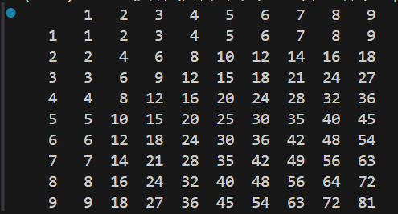
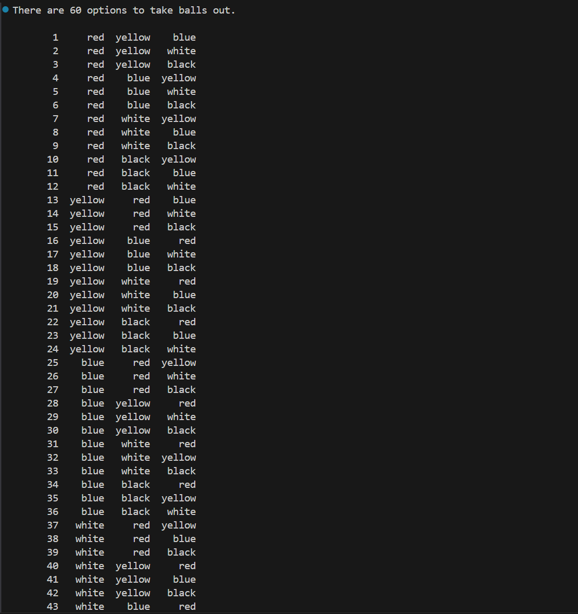
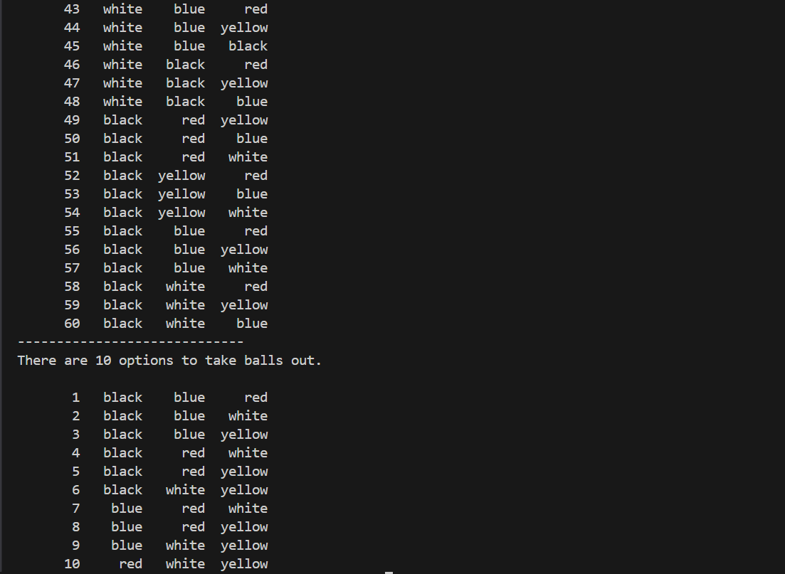

# 编程练习一
```c++
#include <iostream>

using namespace std;

int a,b;

int main()
{
    while(cin>>a>>b){
        for(auto i = a;i <= b;i ++)
            cout<<char(i);
        cout<<endl;
    }
    return 0;
}
```
## 运行结果


# 编程练习二
```c++
#include <iostream>
#include <vector>
#include <iomanip>

using namespace std;

vector<int> a{0,1,2,3,4,5,6,7,8,9};

template<typename T>
void print(const T& value) {
    cout << setw(4) << value;
}

int main()
{
    for(const auto i : a){
        for(int j : a)
            {
                if(i == 0 && j == 0) print("");
                else
                {
                    auto result = i*j;
                    if(result == 0)  print(((i==0) ? j : i));
                    else print(result);
                }
            }
        cout<<endl;
    }
    return 0;
}
```
## 运行结果


# 编程练习三
```c++
#include <bits/stdc++.h>

using namespace std;

vector<string> s{"red","yellow","blue","white","black"},result(3);

set<vector<string>> res;
vector<vector<string> > res1;

int vit[6] = {0};

void print1()
{
    int ans = 0;
    cout<<"There are "<<res1.size()<<" options to take balls out.\n";
    cout<<endl;
    for(auto x : res1)
    {
        cout<<setw(8)<<++ans;
        for(auto i : x)
        {
            cout<<setw(8)<<i;
        }
        cout<<endl;
    }
    res1.clear();
}


void print2()
{
    int ans = 0;
    cout<<"There are "<<res.size()<<" options to take balls out.\n";
    cout<<endl;
    for(auto x : res)
    {
        cout<<setw(8)<<++ans;
        for(auto i : x)
        {
            cout<<setw(8)<<i;
        }
        cout<<endl;
    }
    res.clear();
}

void solve1(int k)
{   
    if(k >= 3)
    {
        res1.push_back(result);
        k = 0;
        return;
    }

    for(int i = 0;i < 5;i++)
    {
        if(!vit[i])
        {
            vit[i] = 1;
            result[k] = s[i];
            solve1(k+1);
            vit[i] = 0;
        }
    }
}

void solve2(int k)
{
    if(k >= 3)
    {
        vector<string> tmp = result;
        sort(tmp.begin(), tmp.end());
        res.insert(tmp);
        return;
    }

    for(int i = 0;i < 5;i++)
    {
        if(!vit[i])
        {
            vit[i] = 1;
            result[k] = s[i];
            solve2(k+1);
            vit[i] = 0;
        }
    }
}

int main()
{
    solve1(0);
    print1();
    cout<<"-----------------------------\n";
    solve2(0);
    print2();
    return 0;
}
```
## 运行结果

